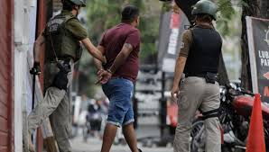
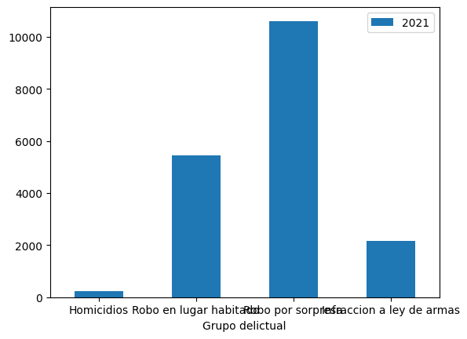
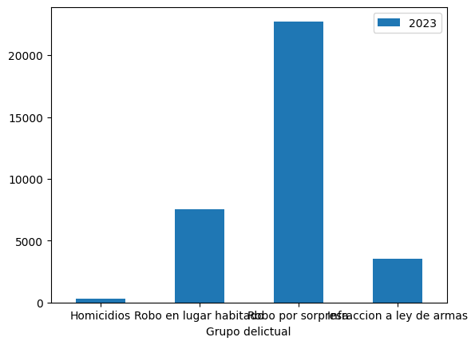
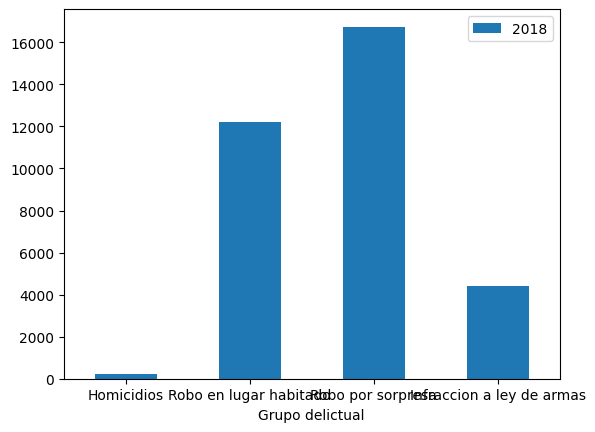

# Visualización datos de delitos en la provincia de Santiago

## Delitos en Santiago
Desde el **2018 al 2023**, los delitos de connotación social en Chile han disminuido de **200,188 a 181,660**, lo que representa una reducción del **9.26%**. Siendo la pandemia un claro atenuante, considerando la particularidad de la baja de las cifras durante el 2021. A pesar de esta tendencia general a la baja, es importante destacar que **algunos tipos de delitos han experimentado un aumento particular durante este mismo período**, lo que subraya la necesidad de enfoques específicos para abordar las áreas donde la criminalidad sigue siendo una preocupación creciente.

## Evolución de delitos

Los registros del __2018__ muestran que se registraron un total de __227__ casos policiales que involucraron homicidio. En el caso de los __robos en lugar habitado__ se registraron __12207__. __Robos por sorpresa__ un total de __16740__ y por último, __4401__ casos de __infracción a la ley de armas__.

Para el 2021, __los homicidios fueron uno de los cuatro delitos de connotación social que no mostraron baja__, sino todo lo contrario, ascendiendo a la cifra de 236, con un peak el 2020 de 360. En el caso del delito de __robo en lugar habitado__, las cifras disminuyeron considerablemente a __5432__, más de un __50%__. Los robos por sorpresa también bajaron en más de __6000 casos__ y el delito de __infracción a la ley de armas__ también bajó más del __50%__.

Los datos recientes del __2023__ muestran que el delito de __homicidio viene en una constante alza desde el 2021__, llegando a los __331 casos__. En el caso del delito de robo en lugar habitado no existe un patrón tan marcado, pero sí existió un alza con respecto al 2022. El delito de __robo por sorpresa__ tiene la misma característica que el homicidio, está en alza desde el 2021, llegando a su peak el __2023 con 22739 casos__. En el caso de la __infracción a la ley de armas__, el alza también es constante desde el 2020, registrando un __alza de más de 1400 casos__.

